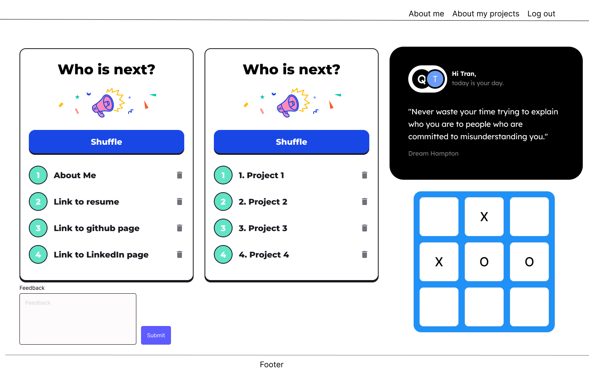

# Tran Huynh's portfolio site

## Premise: Who am I? What can I do? What can I do for you?

## User Story:

* I want to be able to see your resume
* I want to know your bio
* I want to know your contact information
* I want to see your projects
* I want to know your experience
* I want to be able to give feedback in your portfolio site
* I want to know your skills
* I want to know your interests
* I want to have little inspiration note for the day
* I want to have little game to play

## Future promotion: 

What will I do next? Inline with upgrading my skills, experience, and knowledge, I will upgrade my portfolio site in accordance with the user story and feedback received from the user.

## Technology used:

HTML, CSS, SematicUi, Material-ui, Python, Django, API, Postgresql, Pip, GitHub, Heroku, and Git

## Wireframe: 

